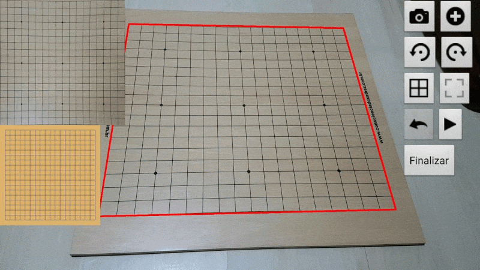
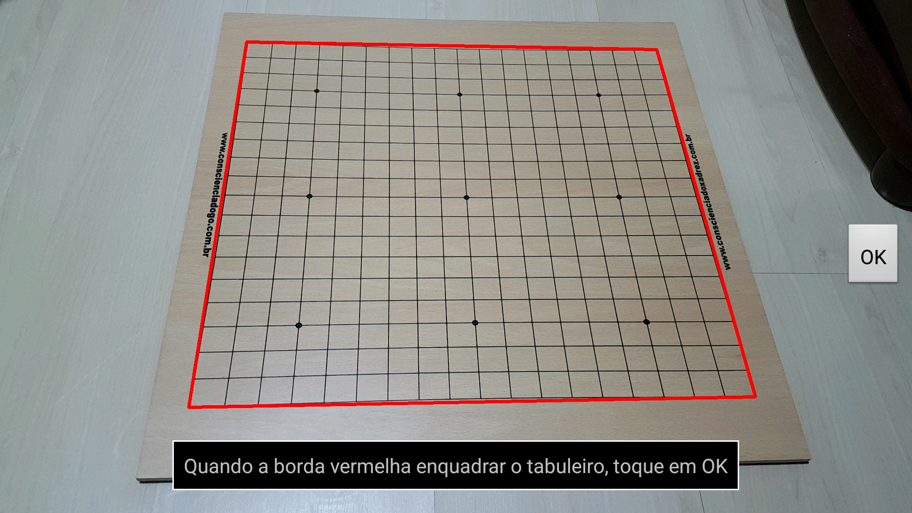
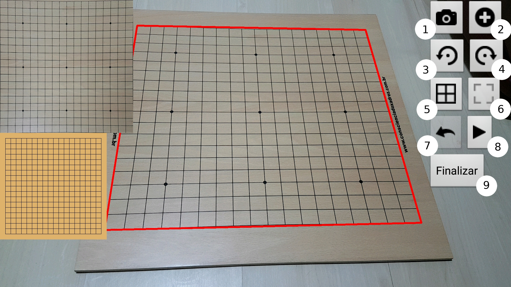

Kifu Recorder
=============

Kifu Recorder is an app which aims to record go (weiqi, baduk) matches in a
simple and easy way. It uses a mobile device's camera to watch a go game and
creates a SGF game record as output. It works well in optimal conditions
(bright environment, good camera positioning), but it's still a work in
progress.

It can be downloaded for free on Google Play at
https://play.google.com/store/apps/details?id=br.edu.ifspsaocarlos.sdm.kifurecorder.

Please send any feedback to kifurecorder@gmail.com!

How to use
==========

The easiest way to use Kifu Recorder is to install it via Google Play. If you
want to compile the source code and install it by yourself, you should download
this repository's code and open the project in Android Studio. You should also
integrate the OpenCV4Android library, which is OpenCV with Android mappings.
The OpenCV version currently used in Kifu Recorder is 3.4.1.

Using the app is quite simple: first you choose the "Start game recording"
menu option. Then you fill the game's basic information - who are the players
with black and white stones and the desired _komi_ - and press the "Detect
board" button. From this point on, I recommend that you keep your device still
by using a tripod or some other apparatus.

Your device's camera should have a full view of the game board. When Kifu
Recorder detects the game board, it draws a red contour around it. When the red
border is correctly enclosing the board, press "OK". Now the game recording
phase begins.

The game recording screen has a lot of buttons, but they are quite
self-explanatory.

1) Take snapshot
2) Manually add move - If the app is not detecting a stone, you can manually
   add it to the game record.
3) Rotate left and
4) Rotate right - sometimes the app will detect the board in a different
   orientation than your point of view, so you can use these buttons to fix
   that.
5) Restore board position - Kifu Recorder has a board tracking feature to track
   where the board is in the camera image. Sometimes that tracking can go
   astray, so this button will reset the board to its initial detected position.
6) Toggle board tracking - If you feel board tracking is not working well, you
   can disable it by pressing this button.
7) Undo - Undoes the last detected move. Useful when the app detects a wrong
   stone
8) Pause/Continue - Pauses the game recording
7) Finish - Terminates game recording

Motivation
==========

This app was initially developed as a conclusion work for the mobile systems
development specialization course of IFSP-São Carlos. I am a Go player myself
and decided to use the conclusion project of the course as an opportunity to
implement a Go Kifu Recorder application which could possibly help other
players.

You can read the resulting monograph [here](readme/monograph.pdf)
(Portuguese only for now).

Changelog
=========

### 1.2.1 - 27/07/2019

Minor improvements

- Save button was removed because the game is saved automatically after every
  detected move now.
- Improved this README

### 1.2.0 - 25/07/2019

The main improvement in this release is dynamic board tracking. Up until
versions 1.1.X, board detection was done once and the board and camera had to
remain still for the remainder of the game recording. Any movement resulted
in detection errors. This version solves this problem for small camera or board
movements.

There is still a lot of room for improvement, so if you feel that board
tracking is not working well, it can be disabled by pressing the "Toggle board
tracking" button.

License
=======

This code is released under the MIT license.
